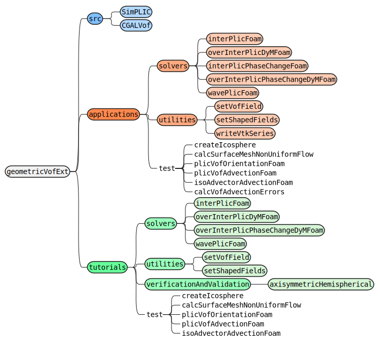
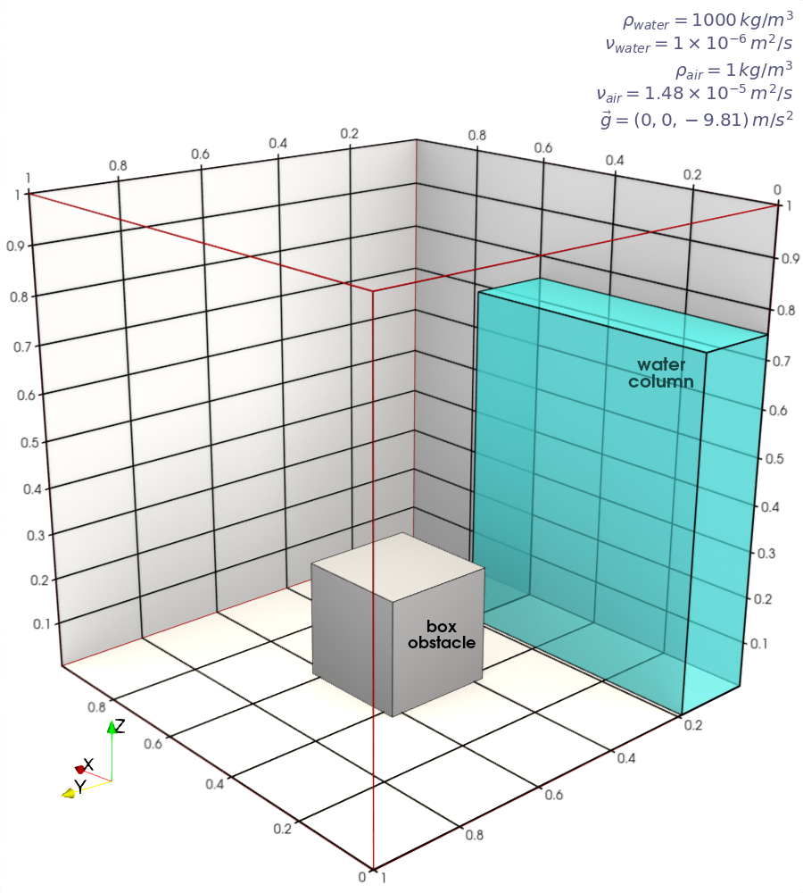
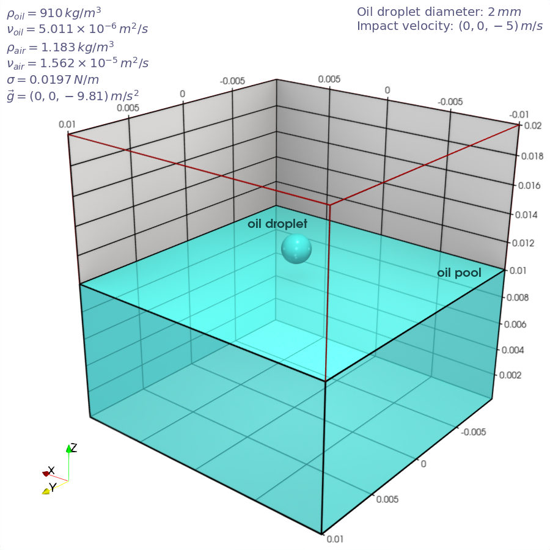
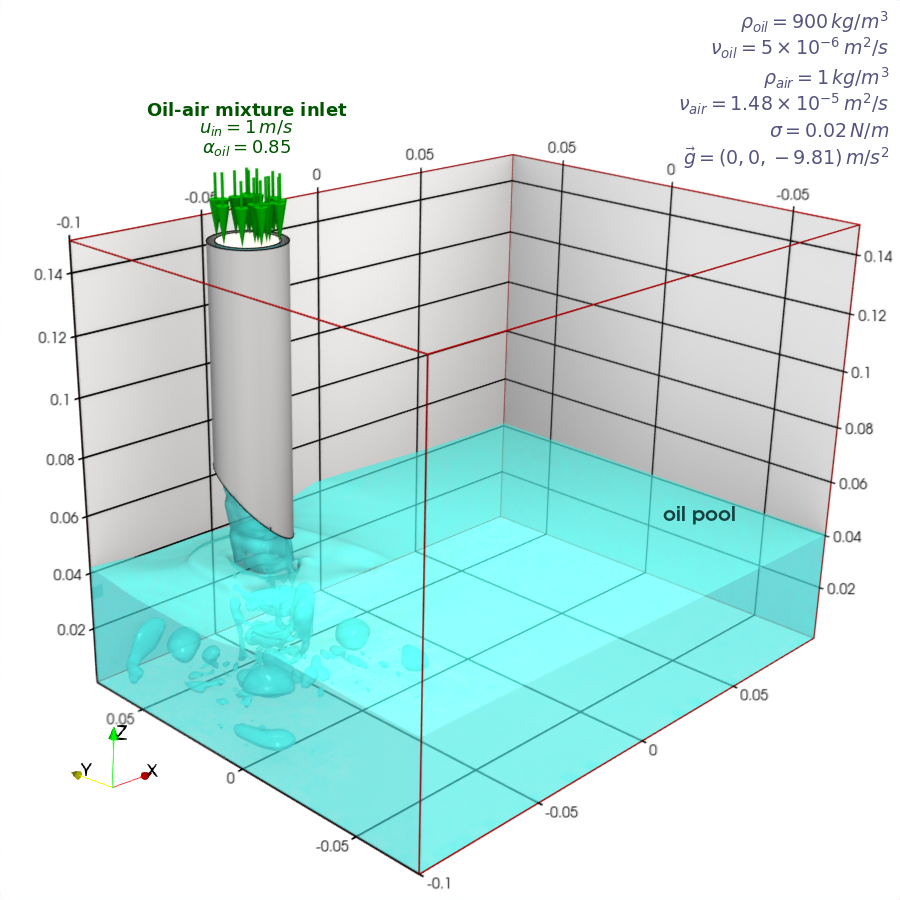
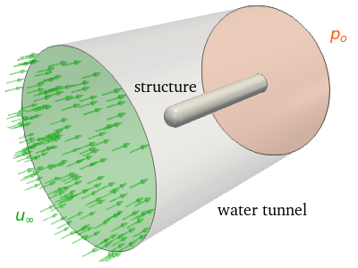
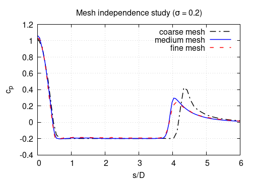
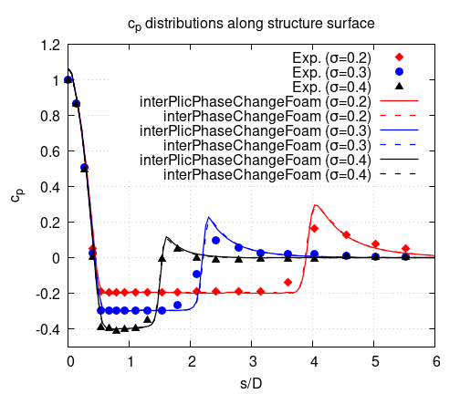
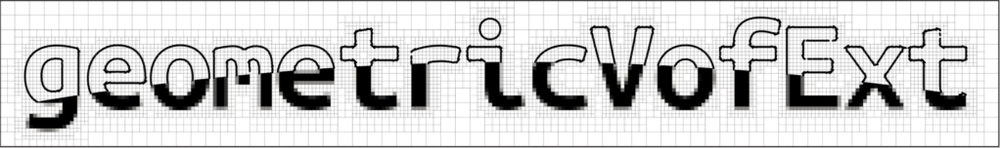

<h1 align="center"><br><tt>geometricVofExt</tt></h1>


<!--  -->


## Overview

The **`geometricVofExt`** package is an unofficial module of the geometric Volume of Fluid (VOF) method for OpenFOAM. This extension has a suite of pre- and post-processing tools alongside various solvers dedicated to two-phase flow dynamics. The pre-processing utilities are methodically assembled to initialize fraction fields of arbitrary shapes with optional dynamic mesh refinement, and to set up scalar, vector or tensor fields that vary based on the fraction values. These utilities are designed to enhance the flexibility and precision of multiphase flow simulations.

Moreover, the **`geometricVofExt`** package features solvers that utilize the innovative [SimPLIC](https://arxiv.org/abs/2402.05247) method, which supports unstructured meshes composed of arbitrary polyhedral cells. The SimPLIC method integrates Piecewise Linear Interface Calculation (PLIC) with Simpson's rule, offering an accurate and efficient approach to solve the VOF equation. These solvers are also designed to simulate the phase change phenomena and floating body dynamics. Additionally, the solvers ensure high adaptability to complex simulation scenarios with optional dynamic mesh refinement.


## Package Structure

The `geometricVofExt` package is a comprehensive collection that includes libraries, applications, and tutorials. This package is meticulously organized to facilitate easy navigation, allowing users to effortlessly utilize the solvers and utilities included in the package. The package structure is shown below.

<div style="text-align: center">
    
</div>

It should be noted that the utilities, solvers and tutorials under `test` are used to replicate the results presented in this study (*Dai, Dezhi, Haomin Yuan, Albert Y. Tong, and Adrian Tentner. "*A Geometric VOF Method for Interface Flow Simulations*." [arXiv preprint arXiv:2402.05247 (2024)](https://arxiv.org/abs/2402.05247)*), which illustrates the concepts and efficiency of the SimPLIC method.


### `SimPLIC` Library

The `SimPLIC` library embodies the implementation of the SimPLIC method.

*Key features*:
- Employs the PLIC-VOF method for precise interface capturing.
- Delivers efficient interface reconstructions for improved computational performance.
- Ensures accurate interface advections, maintaining the fidelity of the fluid interface over time.
- Implements Adaptive Mesh Refinement (AMR) that dynamically refines the mesh based on the fraction field.
- Accommodates overset meshes, enhancing the flexibility in handling complex geometries and moving boundaries.
- Supports run-time PLIC interface sampling.

The VOF equation solved in the `SimPLIC` library is written as:
$$\frac{\partial \alpha}{\partial t} + \nabla \cdot \left(\alpha \mathbf{U}\right) = S_p \alpha + S_u,$$
where $\alpha$ represents the VOF function, $t$ denotes time, $\mathbf{U}$ is the velocity vector, and $S_p$ and $S_u$ correspond to the implicit and explicit contributions to the net source, respectively.

For incompressible two-phase flows without phase change, both $S_p$ and $S_u$ are zero ($S_p = S_u = 0$). In the case of compressible two-phase flows without phase change, $S_p$ remains zero ($S_p = 0$) and $S_u$ is given by $\left(\nabla \cdot \mathbf{U}\right) \alpha$. For incompressible two-phase flows involving cavitation, $S_p = \left(\nabla \cdot \mathbf{U}\right) + \dot{V}_v - \dot{V}_c$ and $S_u$ as $\dot{V}_c$, where $\dot{V}_v$ and $\dot{V}_c$ represent the volume change rates due to condensation and evaporation, respectively. Within OpenFOAM framework, the `Kunz`, `Merkle` or `SchnerrSauer` cavitation model in the `phaseChangeTwoPhaseMixtures` library is adopted to evaluate $\dot{V}_v$ and $\dot{V}_c$. A summary of the different scenarios along with the corresponding solver(s) is given in the table below.

<div style="font-size: 11pt">

|Scenario|Solver(s)|$S_p$|$S_u$|Note|
|:---|:---|:---:|:---:|:---|
|<ul><li>Incompressible</li><li>Without phase change</li></ul>|<ul><li>`interPlicFoam`</li><li>`overInterPlicDyMFoam`</li></ul>|$0$|$0$|$\nabla \cdot \mathbf{U} = 0$|
|<ul><li>Incompressible</li><li>Cavitation</li></ul>|<ul><li>`interPlicPhaseChangeFoam`</li><li>`overInterPlicPhaseChangeDyMFoam`</li></ul>|$\left(\nabla \cdot \mathbf{U}\right) + \dot{V}_v - \dot{V}_c$|$\dot{V}_c$|Cavitation models<ul><li>`Kunz` model</li><li>`Merkle` model</li><li>`SchnerrSauer` model</li></ul>|

</div >

When employing AMR, the geometric interpolation of fraction field during refinement can be achieved by setting the control parameter `mapAlphaField` to `true` within `fvSolution->solvers->"alpha.*"`. This innovative fraction interpolation scheme, initially introduced in [VoFLibrary](https://github.com/DLR-RY/VoFLibrary), has been reimplemented in the `SimPLIC` library. Its process is presented below, where the reconstructed interface within the parent cell is utilized to divide each of the child cells and compute their respective submerged volumes/fractions.

<div style="text-align: center">
    
</div>


### `CGALVof` Library

The `CGALVof` library acts as a bridge between OpenFOAM meshes and CGAL geometric algorithms.

*Key features*:
- Delivers accurate geometric predicates while providing approximate geometric constructions.
- Capable of transforming an OpenFOAM surface mesh (`MeshedSurface<face>`) or an OpenFOAM mesh cell into a CGAL polyhedral surface (`CGAL::Surface_mesh<P>`).
- Allows for the direct creation of CGAL polyhedral surface meshes for boxes or spheres based on given dictionaries.
- Supports the import of external surface mesh files, compatible formats include `*.stl`, `*.vtk` and `*.ftl`.
- Features a Boolean operation processor for the manipulation of two CGAL surface meshes.
- Enables the assessment of mesh cell locations in comparison to a designated surface mesh, typically denoting the interface between two distinct phases.


### Applications

The current list of utilities distributed with `geometricVofExt` is given below:

|Utility|Description|
|:---|:---|
|`setVofField`|Set the VOF field (`alpha.*`) with arbitrary shapes. <ul><li>Built-in shapes: `box`, `sphere`, `cylinder` and `cone`.</li><li>External surface meshes: `*.stl`, `*.stlb`, `*.vtk`, *etc.*</li><li>Fraction-based dynamic mesh refinement.</li></ul>|
|`setShapedFields`|Set field values using arbitrary shapes. <ul><li>Dictionary is similar to the one for `setFields`.</li><li>Volume-fraction averaging for cells partially enclosed by the shapes.</li></ul>|
|`writeVtkSeries`|Generate and write a VTK series for a `surfaces` function object. <ul><li>Function name is `<funcName>`.</li><li>Output file is `<funcName>.vtp.series` or `<funcName>.vtk.series`.</li></ul>|

The following are solvers that utilize the SimPLIC method:

|Solver|Description|
|:---|:---|
|`interPlicFoam`|<ul><li>Solver for two-phase flows.</li><li>Incompressible, isothermal and immiscible fluids.</li><li>Derived from `interFoam` and `interIsoFoam`.</li><li>Using SimPLIC method.</li><li>Dynamic mesh refinement.</li></ul>|
|`overInterPlicDyMFoam`|<ul><li>Derived from `overInterDyMFoam` and `interPlicFoam`.</li><li>Incompressible, isothermal and immiscible fluids.</li><li>Overset (Chimera) meshes.</li></ul>|
|`interPlicPhaseChangeFoam`|<ul><li>Derived from `interPhaseChangeFoam` and `interPlicFoam`.</li><li>Incompressible, isothermal and immiscible fluids.</li><li>Cavitating flows.</li><li>Dynamic mesh refinement.</li></ul>|
|`overInterPlicPhaseChangeDyMFoam`|<ul><li>Derived from `overInterPhaseChangeDyMFoam` and `overInterPlicDyMFoam`.</li><li>Incompressible, isothermal and immiscible fluids.</li><li>Cavitating flows.</li><li>Overset (Chimera) meshes.</li></ul>|


## Build `geometricVofExt`

### Compatibility

The source code of `geometricVofExt` is developed and maintained for [`OpenFOAM v2312`](https://www.openfoam.com/news/main-news/openfoam-v2312).


### Before Starting

* Make sure that [`OpenFOAM v2312`](https://develop.openfoam.com/Development/openfoam/blob/develop/doc/Build.md) has been compiled successfully on the target machine.

* Verify that [`CGAL`](https://develop.openfoam.com/Development/openfoam/blob/develop/doc/Requirements.md) has been successfully compiled/loaded. Otherwise, the `CGALVof` library, `setVofField` and `setShapedFields` will not be compiled.


### Building

* Create a directory named `modules` within `$WM_PROJECT_USER_DIR`, then proceed to download the `geometricVofExt` source code into `$WM_PROJECT_USER_DIR/modules`, *i.e.*,

```shell
source <installation path>/OpenFOAM-v2312/etc/bashrc

[ -d $WM_PROJECT_USER_DIR ] || mkdir $WM_PROJECT_USER_DIR
cd $WM_PROJECT_USER_DIR

[ -d modules ] || mkdir modules
cd modules

git clone https://github.com/daidezhi/geometricVofExt.git
```

* Check `CGAL` library:

```shell
source <installation path>/OpenFOAM-v2312/etc/bashrc

cd $WM_PROJECT_USER_DIR/modules/geometricVofExt

./checkCGAL
```

* (Optional) Enable the utilities and solvers to produce iso-surfaces/plic-surfaces at the initial time (*e.g.*, $t = 0$):

```shell
source <installation path>/OpenFOAM-v2312/etc/bashrc

cd $WM_PROJECT_USER_DIR/modules/geometricVofExt

./enableInitialTimeWriting
```

* Compile libraries, utilities and solvers of `geometricVofExt`:

```shell
source <installation path>/OpenFOAM-v2312/etc/bashrc

cd $WM_PROJECT_USER_DIR/modules/geometricVofExt

./Allwmake -j4
```

* (Optional) Build utilities/solvers in `applications/test`:

```shell
source <installation path>/OpenFOAM-v2312/etc/bashrc

cd $WM_PROJECT_USER_DIR/modules/geometricVofExt

./enableReconstructionTimeTrackingInIsoAdvector

./Allwmake.test
```


## Gallery

|<video src="https://github.com/daidezhi/geometricVofExt/assets/12741725/f68f11a4-2387-4e0d-a0b9-78c1bf2c84df">|<video src="https://github.com/daidezhi/geometricVofExt/assets/12741725/7e643fa2-d036-4196-a890-5e377618438c">|
|:---:|:---:|
|Dam break|Oil deaeration|

|<video src="https://github.com/daidezhi/geometricVofExt/assets/12741725/3f772f22-ba61-4c44-aacd-4001de84018e">|<video src="https://github.com/daidezhi/geometricVofExt/assets/12741725/4bf075dc-7a4f-4cdf-997d-7b6e9a817491">|
|:---:|:---:|
|Droplet impact|Bubble rising|

|<video src="https://github.com/daidezhi/geometricVofExt/assets/12741725/3c5d3191-cd9b-4f31-8ba5-f81bcb1612d6">|
|:---:|
|Cavitation|


## Tutorials

* `./tutorials/utilities/setVofField/`

|Case|Result|
|:---|:---:|
|`variousShapes`||
|`variousShapesAMR1`||
|`variousShapesAMR2`||

* `./tutorials/utilities/setShapedFields/`

|Case|Result|
|:---|:---:|
|`variousShapesAMR1`||

* `./tutorials/solvers/interPlicFoam/`

|Case|<div style="width:500px">Configuration</div>|
|:---|:---|
|`bubbleRising`||
|`damBreakWithObstacle`||
|`dropletImpact`||
|`oilDeaeration`||

* `./tutorials/solvers/overInterPlicDyMFoam/`

|Case|Result|
|:---|:---:|
|`floatingBody`<br>`floatingBody_overInterDyMFoam`|<video src="https://github.com/daidezhi/geometricVofExt/assets/12741725/06fef16e-505d-4b5c-a188-828232234abb">|
|`twoSimpleRotors`<br>`twoSimpleRotors_overInterDyMFoam`|<video src="https://github.com/daidezhi/geometricVofExt/assets/12741725/0f23260f-f4c1-4c8e-ae44-10eb9b47a2c3">|
|`twoSquaresOutDomain`<br>`twoSquaresOutDomain_overInterDyMFoam`|<video src="https://github.com/daidezhi/geometricVofExt/assets/12741725/b219741c-b8ac-4680-94b4-2b9dad83df30">|

* `./tutorials/solvers/overInterPlicPhaseChangeDyMFoam/`

|Case|Result|
|:---|:---:|
|`twoSimpleRotors`<br>`twoSimpleRotors_overInterPhaseChangeDyMFoam`|<video src="https://github.com/daidezhi/geometricVofExt/assets/12741725/9c47fbc9-b3d8-448e-a066-3d9491b9ec51">|

* `./tutorials/verificationAndValidation/`

|Case|Configuration/Result|Note|
|:---|:---|:---|
|`axisymmetricHemispherical`|<ul><li>Case illustration</li><li>Mesh independence</li><li>Pressure coefficient distributions</li></ul>|Mesh independence study is performed by using `interPlicPhaseChangeFoam`.<br><br>This case is configured to verify the SimPLIC method for solving cavitating flows and includes the following solver(s):<ul><li>`interPlicPhaseChangeFoam`</li><li>`interPhaseChangeFoam`</li></ul><br>References:<ul><li>[Rouse, Hunter, and John S. McNown. "Cavitation and pressure distribution: head forms at zero angle of yaw." (1948).](https://na-st01.ext.exlibrisgroup.com/01IOWA_INST/upload/1715609325367/Cavitation%20and%20pressure%20distribution%3A%20head%20forms%20at%20zero%20angle%20of.pdf?Expires=1715609445&Signature=M1RwvwoSRsKXBVPVtjjJfQuKHy4g5KOXMQRXeXe5pzzlPKmfcQ2e~4w-toAcMoxSXShLuyeiqmBZmpnvEnfUOLkEBD1MzHM7KL8UMLZdHibGLoglfMbNjmIV3ufMGpOv~G2nA72t68mRFP0AH-E91JDMG0T0wrbVfSrJMDHdAOoCrczkckc21BDt~Nm6dfL00flFiLB8~c5QE9AxU50py3sWQp4L~ATWxGDT7VB804hIauHzrmdyC-XG3NW4IzkS~G6pHWYgVS2hUrzTGKnAlbeoV5hkrrjh~4gini~WkFENhq9H8B-JIOUmHTsCYKDTnbHGhsq7JMVP79uABYlsvA__&Key-Pair-Id=APKAJ72OZCZ36VGVASIA)</li><li>[ADINA Simulating Cavitation](https://www.ablemax.co.kr/125/?q=YToyOntzOjEyOiJrZXl3b3JkX3R5cGUiO3M6MzoiYWxsIjtzOjQ6InBhZ2UiO2k6MTY7fQ%3D%3D&bmode=view&idx=5381525&t=board)</li></ul>|

* `./tutorials/test/`

|Case|Note|
|:---|:---|
|`createIcosphere`|Create three different icospheres.|
|`calcSurfaceMeshNonUniformFlow`|Calculate tool meshes at various time instants using different initial surface meshes:<ul><li>`initialShapeMeshIcosphere.stlb` (Figure 7(a) in [arXiv:2402.05247](https://arxiv.org/abs/2402.05247))</li><li>`initialShapeMeshNonUniform.stlb` (Figure 7(b) in [arXiv:2402.05247](https://arxiv.org/abs/2402.05247))</li></ul><br>The tool surface meshes used in [arXiv:2402.05247](https://arxiv.org/abs/2402.05247) are available at `./tutorials/test/toolSurfaceMesh`.|
|`plicVofOrientationFoam`|Test four orientation schemes in `SimPLIC`:<ul><li>`CAG`</li><li>`NAG`</li><li>`LS`</li><li>`RDF`</li></ul> using a hexahedral mesh of $\Delta s = 2^{-5} m$ (First row of Table 6 in [arXiv:2402.05247](https://arxiv.org/abs/2402.05247)).|
|`plicVofAdvectionFoam`|Test `SimPLIC-LS` method using a hexahedral mesh of $\Delta s = 2^{-6} m$ (Table 14 in [arXiv:2402.05247](https://arxiv.org/abs/2402.05247)).|
|`isoAdvectorAdvectionFoam`|Test `isoAdvector-plicLS` method using a hexahedral mesh of $\Delta s = 2^{-6} m$ (Table 14 in [arXiv:2402.05247](https://arxiv.org/abs/2402.05247)).|


## Change Log

* 05/13/2024. Initial release.


## Contributors

* Dezhi Dai, Nuclear Science & Engineering (NSE) Division, Argonne National Laboratory (ANL), daid@anl.gov (*Main developer*)
* Haomin Yuan, NSE, ANL (*PI of HPC4EI project, SimPLIC development and review*)
* Albert Y. Tong, Department of Mechanical and Aerospace Engineering (MAE), University of Texas at Arlington (UTA) (*SimPLIC development and review*)
* Adrian Tentner, NSE, ANL (*SimPLIC development and review*)
* Vimalan Adaikalanathan, MAE, UTA (*AMR testing*)


## License

`geometricVofExt` is released as an extension of OpenFOAM: you can
redistribute it and/or modify it under the terms of the
GNU General Public License as published by the Free Software Foundation,
either version 3 of the License, or (at your option) any later version.
See the file COPYING in this directory or
[http://www.gnu.org/licenses/](http://www.gnu.org/licenses), for a
description of the GNU General Public License terms under which you
may redistribute files.


## Acknowledgment

This work was initially funded by the U.S. Department of Energy High-Performance Computing for Energy Innovation (HPC4EI) program, support for this program was provided by the U.S. DOE Office of Science, Office of Fossil Energy, Office of Energy Efficiency & Renewable Energy.

This work was conducted at Argonne National Laboratory and was supported by the U.S. Department of Energy, Office of Nuclear Energy, under Contract DE-AC02-06CH11357.



---